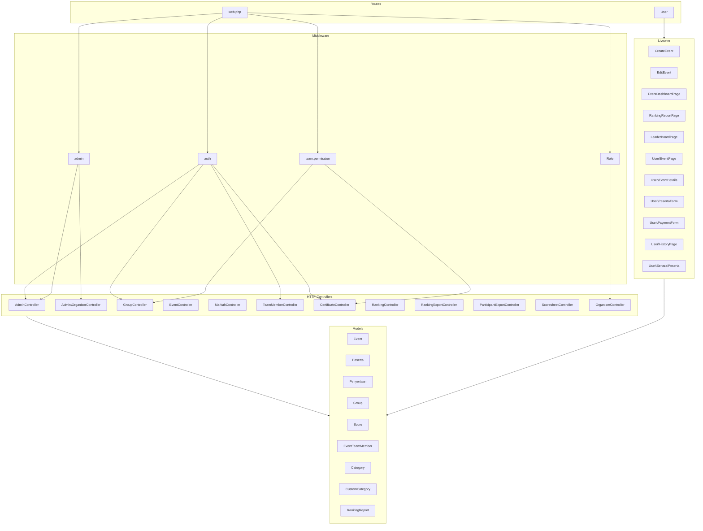
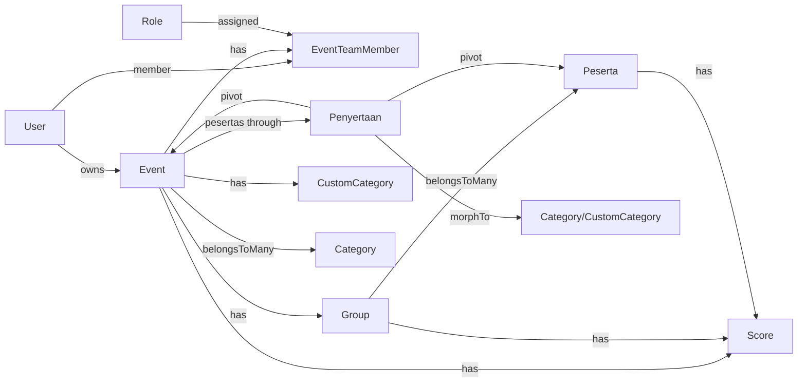

# Components

This document lists the major application components and how they relate to each other.

---

## 1. Component Map

---

## 2. Routes

| File | Purpose |
|------|--------|
| **web.php** | Public routes (home, markah, ads click, team invitation), admin prefix (dashboard, events, participants, grouping, ranking, scoresheets, certificates), organiser prefix (dashboard, team). |
| **user.php** | User-facing: event list, event details, registration form, payment form, history, settings (Volt), certificates gate. |
| **console.php** | Artisan commands (if any). |

No `api.php` in the project; all endpoints are web (HTML/redirects or file downloads).

---

## 3. Middleware

| Middleware | Alias | Purpose |
|------------|--------|--------|
| **AdminMiddleware** | `admin` | Restrict to `user->role === 'admin'`. Used for super-admin organiser management. |
| **CheckRole** | `role` | Restrict to given roles (e.g. `role:admin,organiser`). |
| **CheckTeamPermission** | `team.permission` | Resolve `event` from route; ensure user is admin/organiser or accepted team member with the given permission. |

**CheckTeamPermission** flow: Require auth → if admin/organiser allow → else find EventTeamMember for route event and user with status `accepted` → check `hasPermission($permission)` via Role → 403 if not.

---

## 4. HTTP Controllers

| Controller | Main responsibility |
|------------|---------------------|
| **AdminController** | Dashboard, participants list/view, event-scoped; uses `getEventsForUser()`. |
| **Admin\OrganiserController** | CRUD organisers (index, create, store, edit, update, destroy), view organiser dashboard. |
| **GroupController** | Grouping index, groups list, store group, auto-group, assign/move/remove participants, grouping by category. |
| **EventController** | Ad click tracking. |
| **MarkahController** | Score form by group token; submit scores (public). |
| **TeamMemberController** | Team index, create, store, edit, update, destroy, updateRole, resend invitation; accept invitation by token. |
| **CertificateController** | Certificate management page, update settings, export single/group/all (PDF/ZIP). |
| **RankingController** | Ranking show. |
| **RankingExportController** | Export ranking (Excel), export sheet, export PDF. |
| **ParticipantExportController** | Export participants (Excel/CSV), export participants PDF. |
| **ScoresheetController** | Export scoresheet per group or all groups. |
| **OrganiserController** | Organiser dashboard. |

Relationships between controllers and models:

- **AdminController**, **GroupController**: Event, Peserta, Penyertaan, Category/CustomCategory (via query).
- **TeamMemberController**: Event, EventTeamMember, Role, User, Mail.
- **MarkahController**: Group, Score, Event, Peserta, Penyertaan.
- **CertificateController**: Event, Peserta, Penyertaan, Category, CustomCategory, PDF, Storage.
- **GroupController**: Event, Group, Peserta, DB (raw for category resolution).

---

## 5. Livewire Components

| Component | Route / context | Purpose |
|-----------|------------------|--------|
| **CreateEvent** | GET /admin/create-event | Create event (with categories/custom categories). |
| **EditEvent** | GET /admin/events/{id}/edit | Edit event. |
| **EventDashboardPage** | GET /admin/events/{event}/dashboard | Event dashboard. |
| **RankingReportPage** | GET /admin/ranking-report/{event} | Ranking report. |
| **LeaderBoardPage** | GET /admin/event/{event}/leaderboard | Leaderboard. |
| **EventPage** | GET /events | Public event list. |
| **EventDetails** | GET /events/{id} | Event detail page. |
| **PesertaForm** | GET /daftar/{id} | Participant registration for event. |
| **PaymentForm** | GET /payment/{event_id} | Payment confirmation (status_bayaran). |
| **HistoryPage** | GET /history | User’s event history. |
| **SenaraiPeserta** | GET /history-participant/{eventId} | Participant list for an event (for logged-in user). |

Other: **OrganiserDashboard**, **HeaderSearch**, **GroupAssign**, **EventList**, **Actions\Logout** (used in layouts/settings).

---

## 6. Eloquent Models and Relationships

| Model | Key relationships |
|-------|-------------------|
| **User** | `ownedEvents()` (Event), `teamMemberEvents()` (Event via EventTeamMember). |
| **Event** | `user` (owner), `teamMembers`, `groups`, `categories`, `customCategories`, `pesertas` (via penyertaan). `canBeAccessedBy()`, `userHasPermission()`, `getCertificateTemplatePath()`. |
| **Peserta** | `events` (via penyertaan), `groups`. |
| **Penyertaan** | Pivot: `event`, `peserta`, `pendaftar` (User), `group`, `categorizable` (morphTo Category|CustomCategory). |
| **Group** | `event`, `pesertas` (pivot group_peserta with event_id). Token, QR generation. |
| **Score** | `event`, `group`, `peserta`. Average computed on save. |
| **EventTeamMember** | `event`, `user`, `role`. `hasPermission()`, invitation status/expiry. |
| **Role** | `teamMembers`, `creator`. `hasPermission()`, permissions array. |
| **Category** | `events` (category_event). |
| **CustomCategory** | `event`, `user`. |
| **RankingReport** | (Reporting; linked to event). |

---

## 7. Configuration and Supporting Code

| Item | Purpose |
|------|--------|
| **config/team_permissions.php** | `all_permissions` (keys, labels, groups), `role_permissions` (default permissions per system role). |
| **App\Mail\TeamMemberInvitation** | Mailable for team invitation email. |
| **BreadcrumbServiceProvider** | Breadcrumb registration for UI. |
| **FortifyServiceProvider** | Auth features (login, register, 2FA). |
| **VoltServiceProvider** | Livewire Volt for settings pages. |

---

## 8. Relationship Summary Table

| From | To | Relationship type |
|------|----|--------------------|
| User | Event | One-to-many (owner) |
| User | EventTeamMember | One-to-many |
| Event | EventTeamMember | One-to-many |
| Event | Group | One-to-many |
| Event | Score | One-to-many |
| Event | Peserta | Many-to-many (penyertaan) |
| Event | Category | Many-to-many (category_event) |
| Event | CustomCategory | One-to-many |
| Role | EventTeamMember | One-to-many |
| Group | Peserta | Many-to-many (group_peserta) |
| Group | Score | One-to-many |
| Peserta | Score | One-to-many |
| Penyertaan | Category / CustomCategory | Polymorphic (categorizable) |

---

For request/response details and all URLs, see **API_DOCUMENTATION.md**. For flows and diagrams, see **SYSTEM_FLOW.md**.
