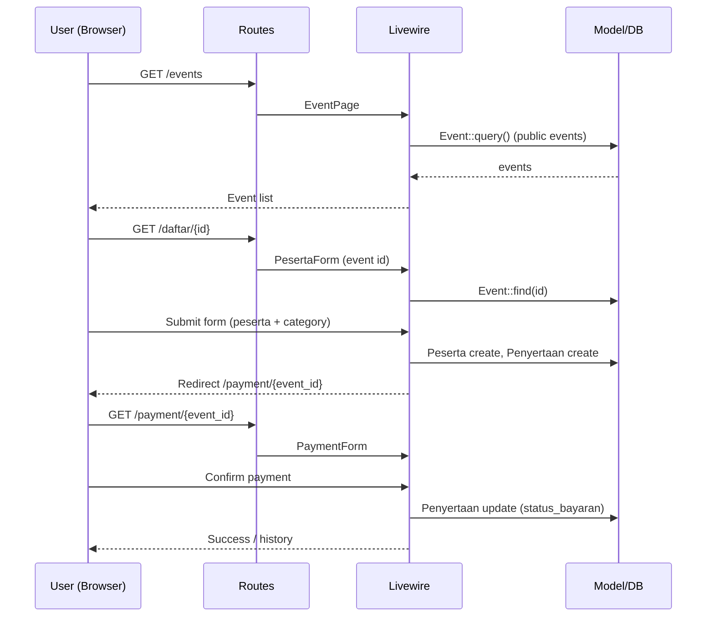
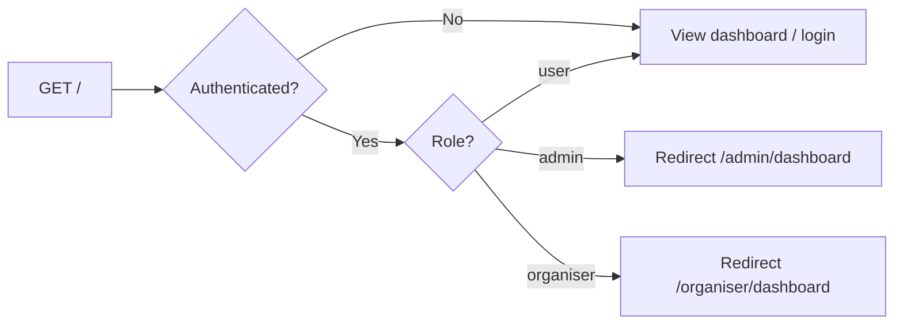
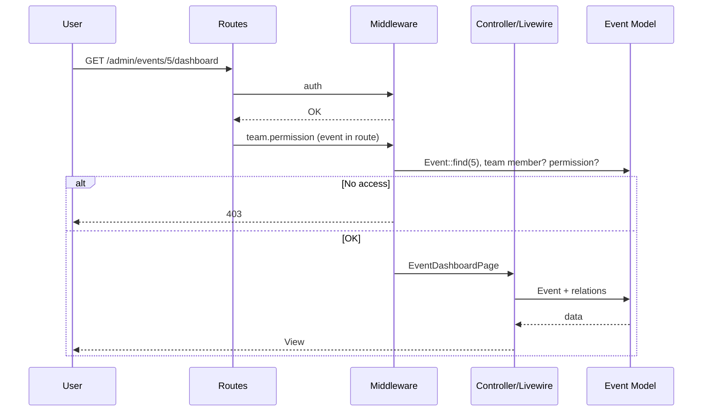
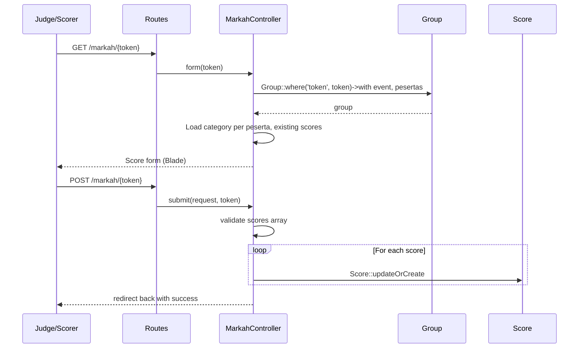
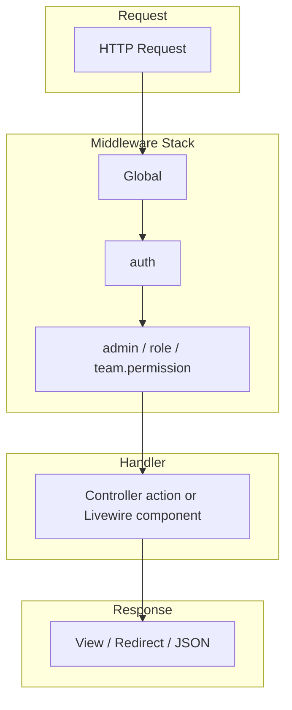
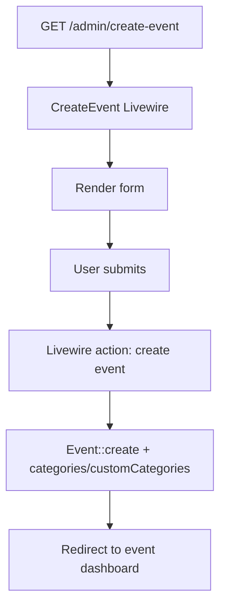
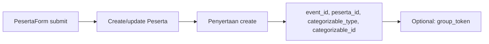
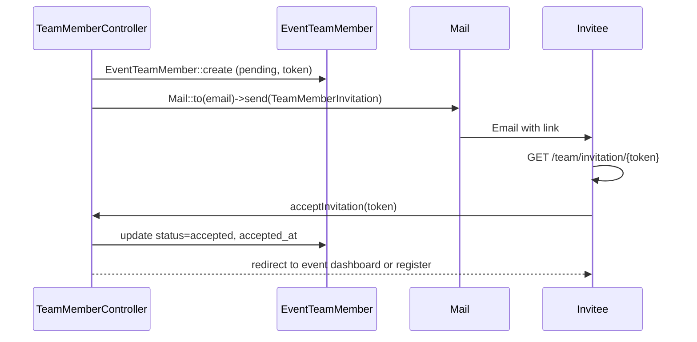
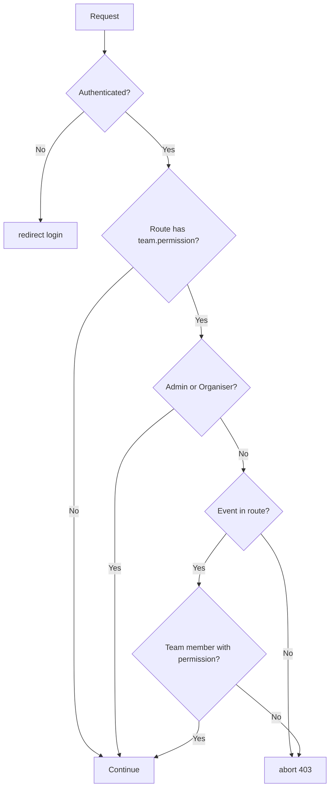
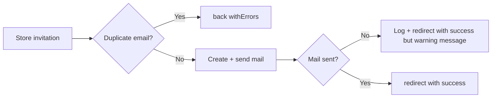

# System Flow

This document describes how data and control move through the system: user interaction, HTTP request/response, database operations, service usage, and error handling.

---

## 1. User Interaction Flow

### 1.1 Anonymous User: Browse Events → Register as Participant



### 1.2 Authenticated User: Login and Role-Based Redirect



### 1.3 Organiser / Team: Event Dashboard and RBAC



### 1.4 Score Submission (Public Token-Based)



---

## 2. HTTP Request/Response Cycle

### 2.1 Generic Request Lifecycle



### 2.2 Typical Controller Flow (e.g. Team Member Store)

```mermaid
flowchart LR
    A[POST /organiser/events/1/team] --> B[Auth]
    B --> C[role: admin,organiser]
    C --> D[TeamMemberController@store]
    D --> E[Event::findOrFail]
    E --> F[Owner check: event.user_id === Auth::id]
    F --> G[Validate request]
    G --> H[Create Role if custom]
    H --> I[EventTeamMember::create]
    I --> J[Mail::send TeamMemberInvitation]
    J --> K[redirect + flash success]
```

- **Success**: Redirect to team index with `session('success')`.
- **Validation failure**: `back()->withErrors()->withInput()`.
- **Authorization failure**: `abort(403, '...')`.

### 2.3 Livewire Flow (e.g. Event Creation)



---

## 3. Database Operations

### 3.1 Main Entity Relationships

```mermaid
erDiagram
    users ||--o{ events : "owns"
    users ||--o{ event_team_members : "member"
    events ||--o{ event_team_members : "has"
    events ||--o{ groups : "has"
    events }o--o{ categories : "category_event"
    events ||--o{ custom_categories : "has"
    events }o--o{ pesertas : "penyertaan"
    pesertas }o--o{ groups : "group_peserta"
    groups ||--o{ scores : "has"
    events ||--o{ scores : "has"
    pesertas ||--o{ scores : "has"
    roles ||--o{ event_team_members : "assigned"

    users { int id string role }
    events { int id int user_id }
    event_team_members { int event_id int user_id int role_id string status }
    groups { int event_id string token }
    penyertaan { int event_id int peserta_id string status_bayaran polymorphic category }
    scores { int event_id int group_id int peserta_id decimal round1,2,3,average }
```

### 3.2 Participant Registration (Peserta + Penyertaan)



- **Peserta**: One record per physical participant (reusable across events).
- **Penyertaan**: Pivot per event; holds category (polymorphic), payment status, group_token.

### 3.3 Grouping and Scores

```mermaid
flowchart TB
    A[GroupController: storeGroup / autoGroup] --> B[Group::create]
    B --> C[Group::generateQrCode (token → URL)]
    C --> D[group_peserta attach]
    D --> E[Judge visits /markah/{group.token}]
    E --> F[MarkahController::submit]
    F --> G[Score::updateOrCreate per peserta]
```

- **Group**: `event_id`, `name`, `capacity`, `token`, `qr_code` (file path).
- **Score**: `event_id`, `group_id`, `peserta_id`, `round1`, `round2`, `round3`, `average` (auto-calculated on save), `remarks`.

---

## 4. Service Layer Interactions

The application does not use dedicated service classes for most logic; controllers and Livewire components call Eloquent models and facades directly.

| Concern | Where it lives | Notes |
|--------|----------------|--------|
| **Auth** | Fortify, middleware | Login, register, 2FA, session |
| **Mail** | `Mail::send()` in controllers | Team invitation (TeamMemberInvitation mailable) |
| **Storage** | `Storage::disk('public')` | Posters, QR codes, certificate templates |
| **PDF** | `Barryvdh\DomPDF` in CertificateController | Certificates, participant PDF export |
| **QR** | `Group::generateQrCode()` | External API (qrserver.com), file stored locally |
| **Permissions** | `config/team_permissions.php` | Permission keys and role defaults |
| **Event access** | `Event::getEventsForUser()`, `Event::canBeAccessedBy()` | Used in AdminController, GroupController |

### 4.1 Mail Flow (Team Invitation)



### 4.2 Certificate Generation Flow

```mermaid
flowchart TB
    A[CertificateController: exportSingle/Group/All] --> B[Load event, participants, categories]
    B --> C[getCertificateTemplatePath (Event model)]
    C --> D[Category / CustomCategory template path]
    D --> E[Pdf::loadView + data]
    E --> F[Stream download or ZIP]
```

---

## 5. Error Handling Flow

### 5.1 Authorization and Abort



- **403**: "Event not found.", "You are not a team member of this event.", "You do not have the required permission: X", or "Only the event organizer can manage team members".
- **404**: `findOrFail()` when resource missing (event, organiser, team member, group, etc.).

### 5.2 Validation Errors

- **Form request validation**: `$request->validate([...])` in controllers.
- **Failure**: `Illuminate\Validation\ValidationException` → redirect back with `errors` and `old()` input.
- **Livewire**: Validation in component; errors shown in form.

### 5.3 Exception Handling

- Laravel default exception handling (`bootstrap/app.php` → `withExceptions`); no custom handler in the codebase.
- Logging: `Log::error()` / `Log::warning()` in places (e.g. certificate category, invitation email failure, QR generation failure).
- User-facing: Redirect with `session('error', '...')` when mail fails or invitation resend fails.

### 5.4 End-to-End Error Flow (Example: Team Invite)



---

## 6. Summary Diagrams

### 6.1 Permission Check (team.permission)

```mermaid
flowchart TD
    R[Route: event in param] --> A[CheckTeamPermission]
    A --> B[user?]
    B -->|No| C[redirect login]
    B -->|Yes| D[admin or organiser?]
    D -->|Yes| E[Allow]
    D -->|No| F[Resolve event from route]
    F --> G[EventTeamMember for user+event, status=accepted]
    G --> H[teamMember->hasPermission(permission)]
    H -->|Yes| E
    H -->|No| I[abort 403]
```

### 6.2 Data Flow Overview

```mermaid
flowchart TB
    subgraph Input["Input"]
        I1[User / Browser]
        I2[Token (markah, invitation)]
    end

    subgraph App["Application"]
        A1[Routes + Middleware]
        A2[Controllers + Livewire]
        A3[Models]
    end

    subgraph Output["Output"]
        O1[Views / Redirects]
        O2[PDF / Excel export]
        O3[Email]
    end

    I1 --> A1
    I2 --> A1
    A1 --> A2
    A2 --> A3
    A3 --> A2
    A2 --> O1
    A2 --> O2
    A2 --> O3
```

This document should be read together with **SYSTEM_OVERVIEW.md**, **COMPONENTS.md**, and **API_DOCUMENTATION.md** for full coverage of architecture, components, and endpoints.
