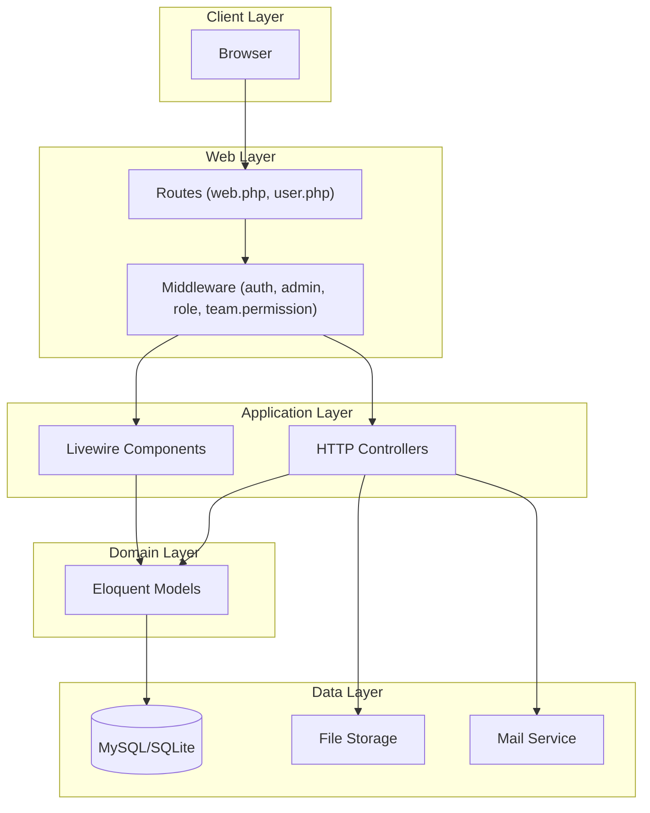
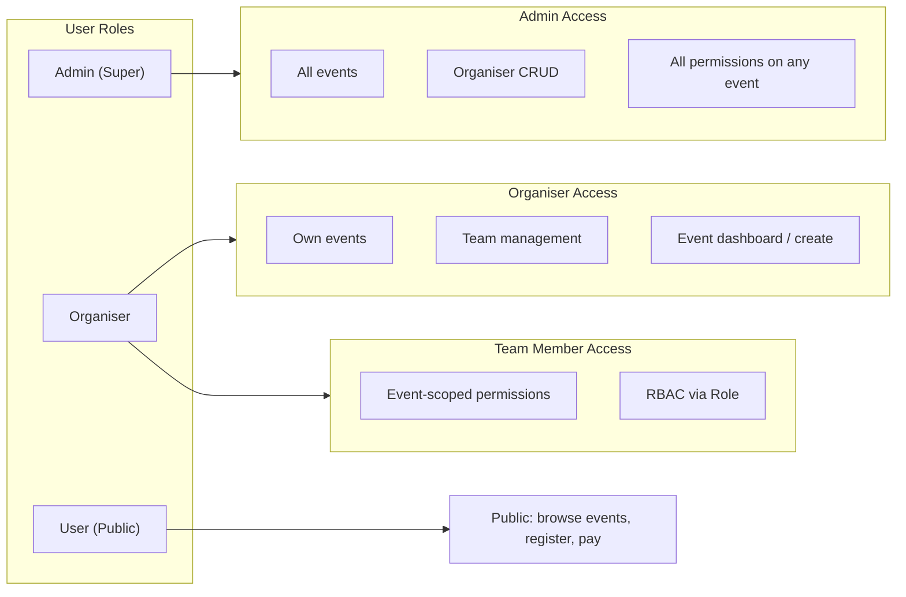

# System Overview

## Purpose

The **Event Management System** is a Laravel-based web application for organising events, managing participants (peserta), grouping, scoring, rankings, and certificates. It supports multiple user roles (Admin, Organiser, Team Members) with role-based access control per event.

---

## High-Level Architecture

---

## Technology Stack

| Layer | Technology |
|-------|------------|
| **Framework** | Laravel (PHP) |
| **Frontend** | Blade templates, Livewire, Volt (settings) |
| **Auth** | Laravel Fortify (login, registration, 2FA) |
| **Database** | Eloquent ORM (MySQL/SQLite via config) |
| **Storage** | Laravel Storage (posters, QR codes, certificates) |
| **Mail** | Laravel Mail (team invitations, notifications) |
| **PDF** | DomPDF (certificates, participant lists) |
| **QR** | External API (qrserver.com) for group score links |

---

## User Roles

- **Admin**: Full access; manages organisers; can access any event.
- **Organiser**: Owns events; manages team members and event lifecycle; has admin-style dashboard.
- **User**: Public participant; browses events, registers (peserta), pays; can view history and certificates when logged in.
- **Team Member**: Invited by organiser; access to specific event(s) based on **Role** permissions (create_event, view_participants, group_participants, manage_scoresheet, submit_scores, manage_certificates).

---

## Core Concepts

### Events

- Created by Admin or Organiser (or users with `create_event` permission).
- Have details: title, description, dates, venue, fees, categories, max participants, posters, ads period.
- Linked to **categories** (global) or **custom categories** (event-specific).

### Participants (Peserta)

- Registered per event via **penyertaan** (event–peserta pivot) with payment status, category (polymorphic: Category or CustomCategory), and optional group token.

### Groups

- Belong to an event; have a unique token and QR code (linking to score submission form).
- Participants are assigned to groups; used for scoring and scoresheets.

### Scores

- Stored per event, group, and participant (round1, round2, round3, average, remarks).
- Submitted via public **markah** form (token-based) or by users with `submit_scores` / `manage_scoresheet`.

### Team & RBAC

- **Event owner** = user who created the event (full control).
- **Event team members** = invited by owner; have a **Role** (system or custom) with a set of **permissions**.
- Permissions gate routes (e.g. `team.permission:view_participants`).

---

## Entry Points

| Audience | Entry |
|----------|--------|
| **Public** | `/` (dashboard), `/events`, `/daftar/{id}`, `/payment/{event_id}`, `/markah/{token}`, `/team/invitation/{token}` |
| **Authenticated User** | `/history`, `/history-participant/{eventId}`, settings (profile, password, appearance, 2FA) |
| **Admin** | `/admin/dashboard`, `/admin/organisers`, `/admin/create-event`, event dashboards |
| **Organiser** | `/organiser/dashboard`, `/organiser/events/{event}/team` |
| **Event-scoped (RBAC)** | `/admin/events/{event}/dashboard`, participants, grouping, ranking, scoresheets, certificates |

---

## Document Map

- **SYSTEM_OVERVIEW.md** (this file) — High-level architecture and concepts.
- **SYSTEM_FLOW.md** — Detailed flows: user interaction, request/response, database, services, error handling, with Mermaid diagrams.
- **COMPONENTS.md** — Major components (controllers, Livewire, models, middleware) and their relationships.
- **API_DOCUMENTATION.md** — All HTTP endpoints (web routes) with method, URL, auth, and request/response examples.
